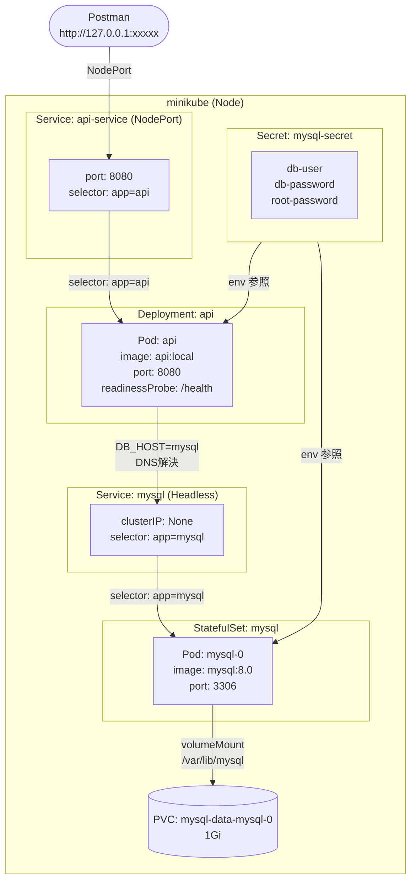

# AWS_study

AWSの基礎構築を学ぶ

## フォルダ構成

```
AWS_study/
├── .gitignore
├── README.md
├── challenge4-1/               # 課題4-1: ECS + CloudWatch監視
│   ├── Backend/
│   │   ├── app/
│   │   │   ├── router/
│   │   │   │   └── tasks.py
│   │   │   ├── database.py
│   │   │   ├── logger.py
│   │   │   ├── main.py
│   │   │   ├── models.py
│   │   │   └── schemas.py
│   │   ├── alembic/
│   │   ├── Dockerfile
│   │   └── requirements.txt
│   └── Infrastructure/
│       ├── alb.tf
│       ├── bastion.tf
│       ├── cloudfront.tf
│       ├── ecr.tf
│       ├── ecs.tf
│       ├── github_actions_iam.tf
│       ├── iam.tf
│       ├── main.tf
│       ├── monitoring.tf
│       ├── network.tf
│       ├── outputs.tf
│       ├── rds.tf
│       ├── secrets.tf
│       ├── security_groups.tf
│       ├── terraform.tf
│       └── variables.tf
├── challenge4-2/               # 課題4-2: EC2(Docker) + SSMデプロイ
│   ├── Backend/
│   │   ├── app/
│   │   │   ├── router/
│   │   │   │   └── tasks.py
│   │   │   ├── database.py
│   │   │   ├── logger.py
│   │   │   ├── main.py
│   │   │   ├── models.py
│   │   │   └── schemas.py
│   │   ├── alembic/
│   │   ├── Dockerfile
│   │   └── requirements.txt
│   └── Infrastructure/
│       ├── alb.tf
│       ├── bastion.tf
│       ├── cloudfront.tf
│       ├── ec2.tf
│       ├── ecr.tf
│       ├── github_actions_iam.tf
│       ├── iam.tf
│       ├── main.tf
│       ├── network.tf
│       ├── outputs.tf
│       ├── rds.tf
│       ├── secrets.tf
│       ├── security_groups.tf
│       ├── terraform.tf
│       └── variables.tf
└── challenge4-3/               # 課題4-3: Kubernetes (minikube)
    ├── Backend/
    │   ├── app/
    │   │   ├── router/
    │   │   │   └── tasks.py
    │   │   ├── database.py
    │   │   ├── logger.py
    │   │   ├── main.py
    │   │   ├── models.py
    │   │   └── schemas.py
    │   ├── alembic/
    │   ├── Dockerfile
    │   └── requirements.txt
    └── k8s/
        ├── deploy.yaml
        ├── mysql-deploy.yaml
        ├── service.yaml
        └── secret.yaml
```

## 構成一覧

### 課題4-1 — ECS + CloudWatch監視 + Slack通知

ECS構成にCloudWatchアラームとSlack通知を追加した監視強化版

#### アーキテクチャ

```
CloudFront → ALB → ECS(Fargate) → RDS(MySQL)
                        ↓
             CloudWatch Alarm（CPU高騰）
                        ↓
                    SNS Topic
                        ↓
                 Lambda（Slack通知）
```

#### 使用サービス

| サービス        | 役割                                        |
| --------------- | ------------------------------------------- |
| ECS Fargate     | FastAPI アプリをコンテナで実行              |
| RDS (MySQL)     | タスクデータの永続化                        |
| ALB             | ECS へのトラフィック分散                    |
| CloudFront      | API へのキャッシュなし配信                  |
| CloudWatch      | ECS CPU使用率アラーム・構造化ログクエリ定義 |
| SNS             | アラームイベントの配信                      |
| Lambda          | SNS 受信 → Slack Webhook 通知               |
| Secrets Manager | DB パスワードの管理                         |
| ECR             | コンテナイメージの管理                      |
| EC2踏み台       | RDS へのマイグレーション実行                |

#### CI/CD

- `challenge4-1/Backend/**` への push で自動デプロイ
- ECR へイメージをビルド＆プッシュ → ECS タスク定義更新

---

### 課題4-2 — EC2(Docker) + SSMデプロイ

ECSを使わずEC2上でDockerコンテナを直接動かし、SSM経由でデプロイする構成

#### アーキテクチャ

```
CloudFront → ALB → EC2(Docker: FastAPI) → RDS(MySQL)
```

#### 使用サービス

| サービス        | 役割                                         |
| --------------- | -------------------------------------------- |
| EC2             | Docker コンテナで FastAPI を実行（t3.micro） |
| RDS (MySQL)     | タスクデータの永続化                         |
| ALB             | EC2 へのトラフィック分散                     |
| CloudFront      | API へのキャッシュなし配信                   |
| ECR             | コンテナイメージの管理                       |
| SSM             | EC2 への `docker pull` / `docker run` 発行   |
| Secrets Manager | DB パスワードの管理                          |
| EC2踏み台       | RDS へのマイグレーション実行                 |

#### CI/CD

- `challenge4-2/Backend/**` への push で自動デプロイ
- ECR へイメージをビルド＆プッシュ → SSM send-command で EC2 上のコンテナを更新

---

### 課題4-3 — Kubernetes (minikube)

クラウドを使わずローカルの minikube 上で同等のアプリを動かす構成

#### アーキテクチャ



#### k8s リソース

| リソース     | 種別        | 内容                                 |
| ------------ | ----------- | ------------------------------------ |
| api          | Deployment  | FastAPI コンテナ（image: api:local） |
| api-service  | Service     | NodePort 8080（Postman アクセス用）  |
| mysql        | StatefulSet | MySQL 8.0 + 永続ボリューム 1Gi       |
| mysql        | Service     | Headless（Pod DNS 解決用）           |
| mysql-secret | Secret      | DB認証情報                           |

#### ローカル起動手順

```bash
# minikube 起動
minikube start

# イメージをビルドして minikube に渡す
eval $(minikube docker-env)
docker build -t api:local ./challenge4-3/Backend

# マニフェストを apply
kubectl apply -f challenge4-3/k8s/secret.yaml
kubectl apply -f challenge4-3/k8s/mysql-deploy.yaml
kubectl apply -f challenge4-3/k8s/deploy.yaml
kubectl apply -f challenge4-3/k8s/service.yaml

# ブラウザ or Postman で確認
minikube service api-service
```
