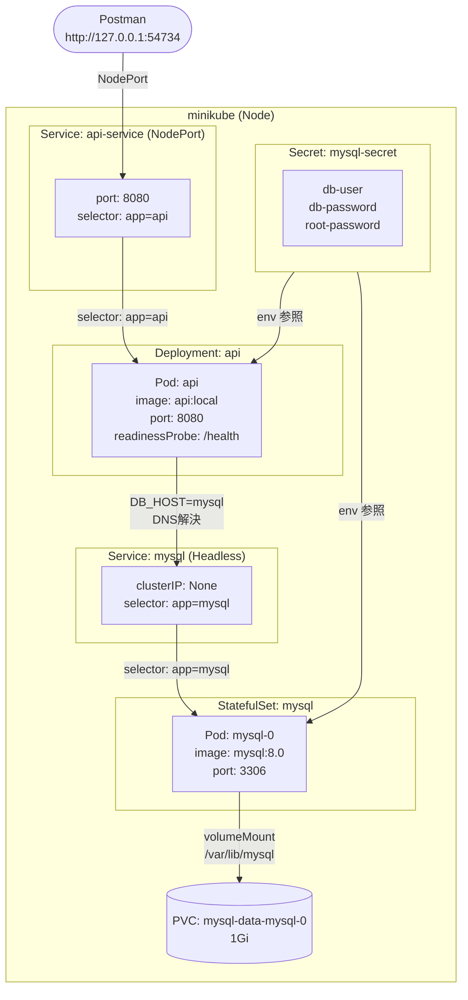

# minikube 起動

```
minikube start
```

---

# イメージをビルドして minikube に渡す

```
eval $(minikube docker-env)
docker build -t api:local ./challenge4-1/Backend
```

---

# Deployment + Service を apply

```
kubectl apply -f deployment.yaml
kubectl apply -f service.yaml
```

---

# ブラウザで確認

```
minikube service api-service
```

# データフロー


